# url-lookup-app
A multi-tiered URL lookup application.

##Requirements:
* [Docker](https://www.docker.com/products/overview) 1.13 or higher

##Instructions (production version):
1. Download and install Docker for your OS.
2. Clone this repository to a location on your hard drive.
3. Set permissions for the `run-app.sh` file in the root directory.
4. Run the `./run-app.sh` file and it will do some initial clean up and run `docker-compose up` which will get the application up and running.
5. The web app can be reached at `http://localhost:3000` and the service layer can be reached at `http://localhost:8008/1/url-info/`.

Downloaded Docker images:
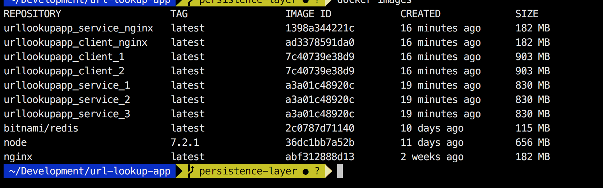

docker-compose up and running:
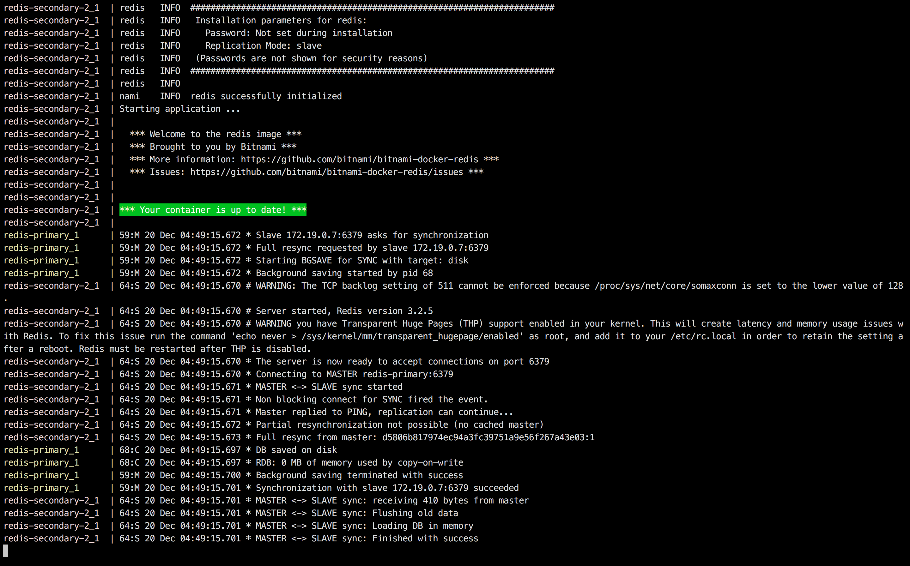

##Tests:
1. Navigate to the `server` folder and run `npm install`.
2. Also run `npm install mocha -g` to install mocha globally.
3. Run `npm test`.

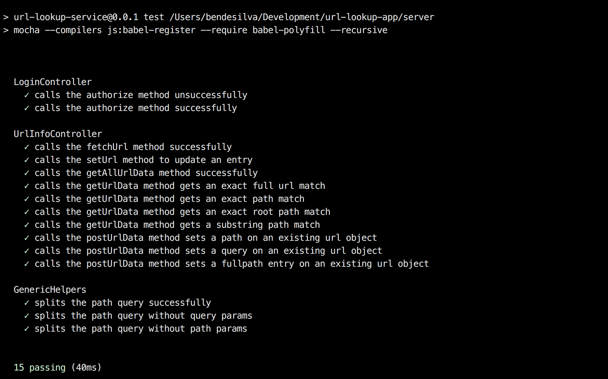

###Web layer interaction:
1. Open a web browser (preferrably Chrome) and point it to `http://localhost:3000`.
2. At the login screen, enter the username **opendns** and the password **superadmin** in order to login to the portal.
    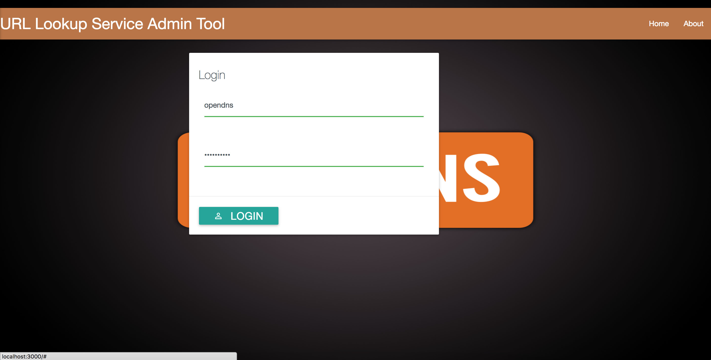
3. You will then be directed to the main dashboard where you can do the following:
    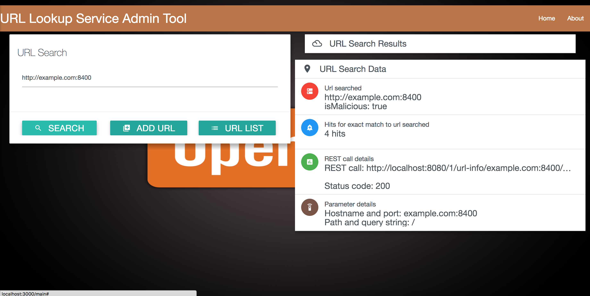
    * Check for a malicious url from the data store
        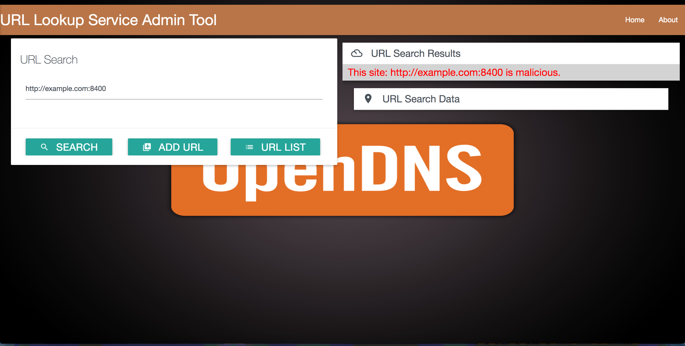
    * Add a url to the data store in order to mark it malicious
        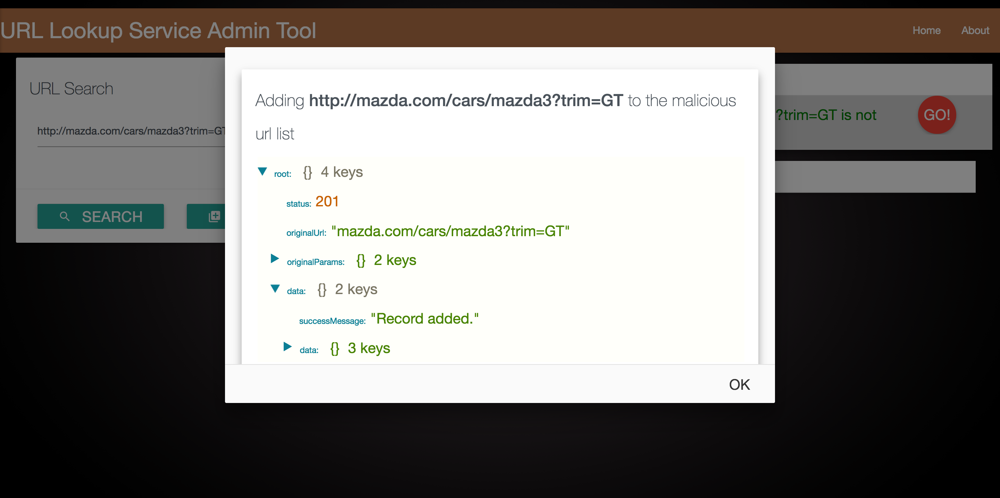
    * Prevention in adding duplicate urls
        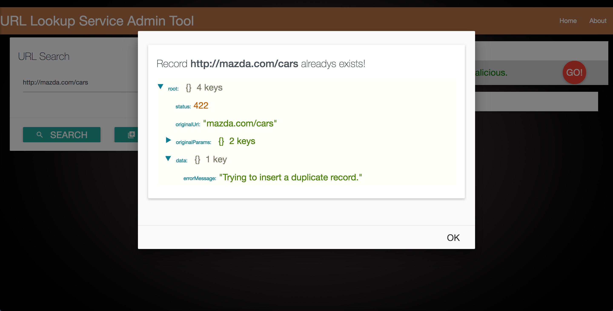
    * Get a running list of all stored malicious urls from the data store
        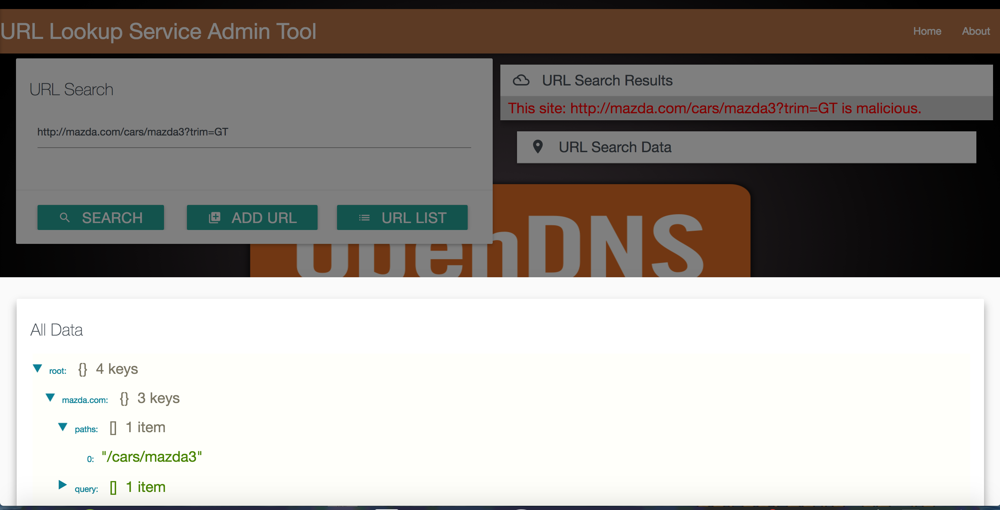

###Api layer interaction:
1. Open a RESTFul client or a browser (I use [Postman](https://www.getpostman.com/) in these examples) and you can do the following:
    * Get all the stored malicious urls from the data store
        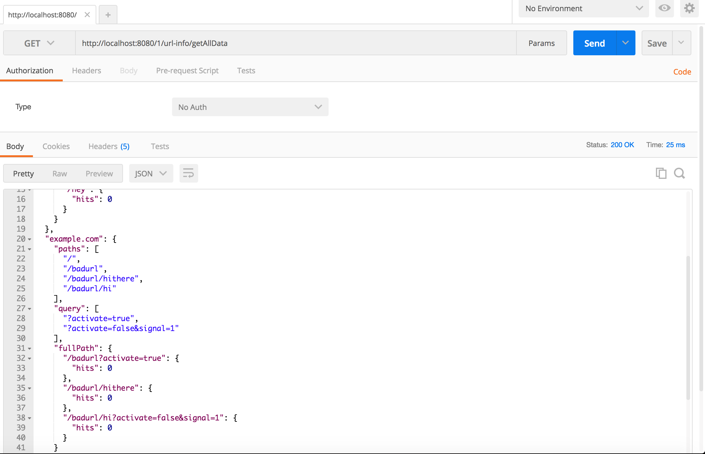
    * Search for a malicious url from the data store
        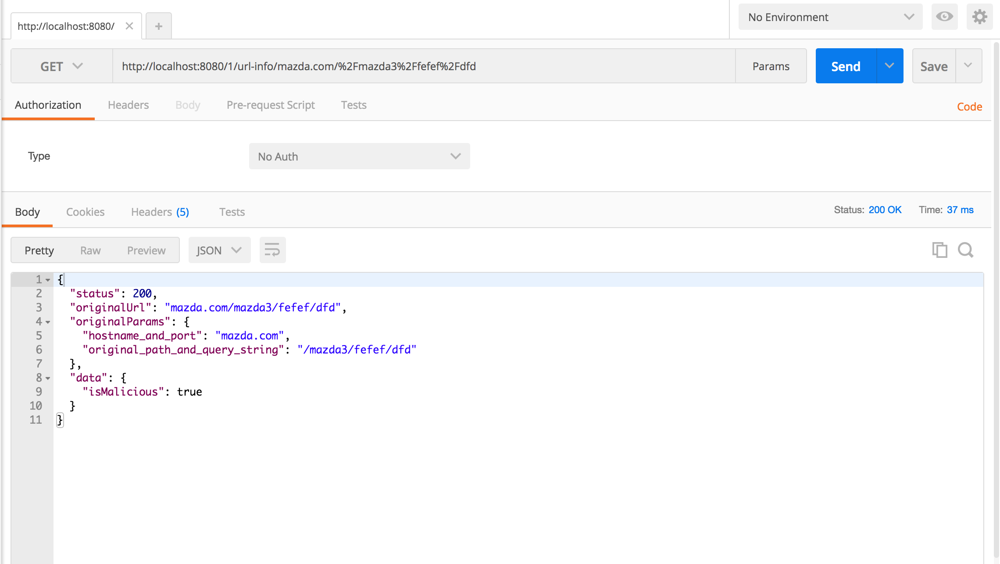
    * Post a url to the data store
        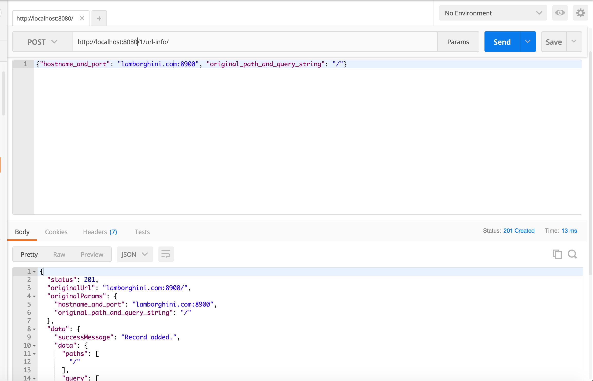

###Technologies used:
*Client side:*
    * ReactJS
    * JavaScript (ES6/ES7)
    * Webpack
    * Express.js
    * Babel
    * HTML5/CSS3
    * Materialize

*Server side:*
    * Node.js
    * JavaScript (ES6/ES7)
    * Koa.js
    * Mocha/Chai

*Infrastracture:*
    * Nginx
    * Docker

*Data store*
    * Redis cluster

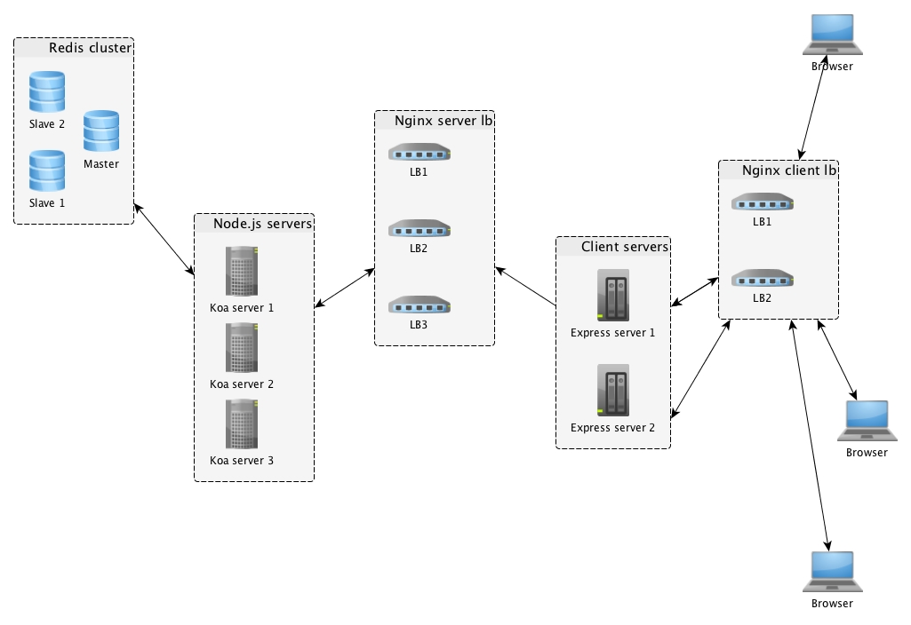

###Thoughts on architecture:
The way I archited this was with extensibility in mind, and scalability as the key driver. I used microservices and containerized from the beginning in order to keep the system decoupled and loose while I ran my testing. So armed with Apache's Bench, I continued to run 10000 requests with a concurrency of 30 (`ab -n 10000 -c 30 http://localhost:3000/`), starting with a single web container, a single service container and one redis instance while keeping a close watch on requests per second alongside Docker's stats to monitor container CPU health. After several rounds of testing, I increased the client servers to two and threw it behind an nginx load balancer using the default round-robin setup which worked well to shuffle web requests due to this not being a heavy traffic-centric application. I increased the server containers to three to share a fair bit of processing load as well as talking to the Redis cluster. For this setup, I used nginx's least connections algorithm to keep the workload efficiently balanced between the servers. I also increased the Redis cluster from one primary and one slave to one primary and two slaves in order to keep the data weight-balanced and ensure high availability of reads. I thought to choose Redis as a data store because it's fast and light-weight, with a key-value store that can easily persist serialized JSON objects which works quite well when persisting URL-related data in small serialized JSON blobs.

On improving this architecture, as load continues to grow, I would suggest auto-scaling the containers (although you can scale at a controlled level with docker-compose `docker-compose scale container=n`) with something like AWS' ECS or Kubernetes or Mesos to keep the scaling dynamic based to load conditions and node health. I would also create another persistence layer to take future load off of the server layer so that it can tackle data workloads more efficiently, and perhaps throw it behing a queueing mechanism to keep the servers optimal.
